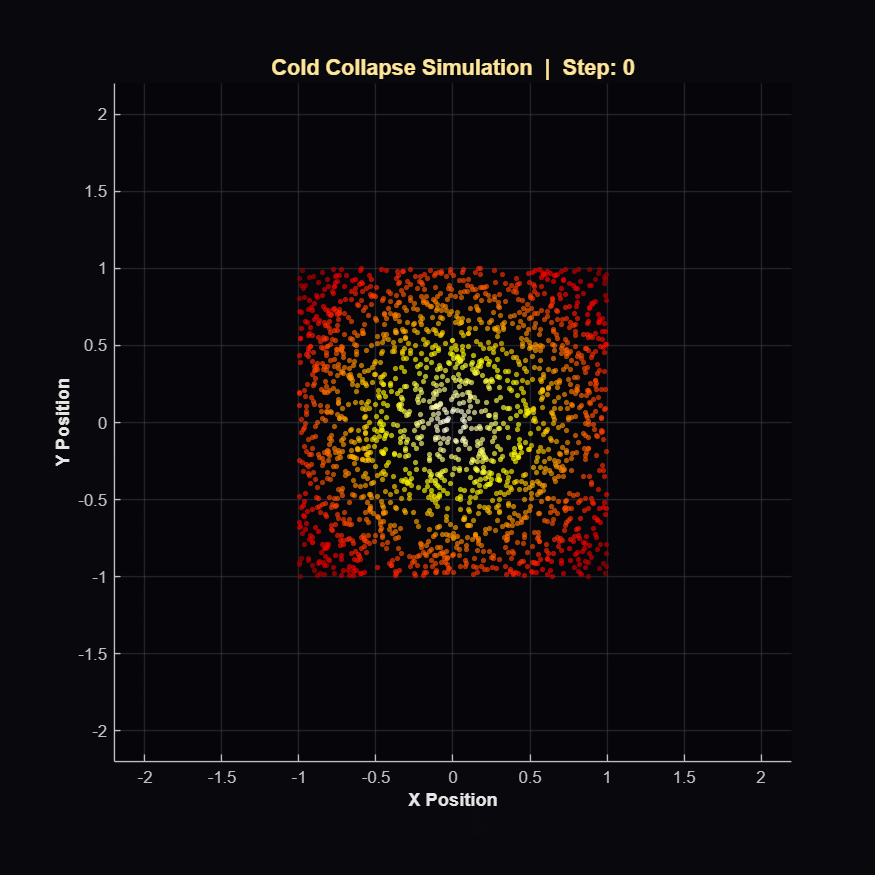
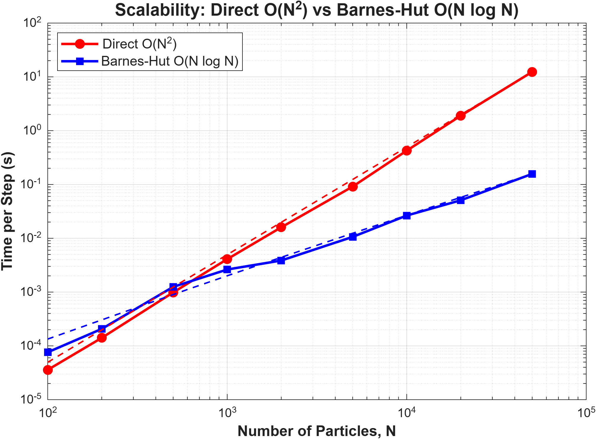
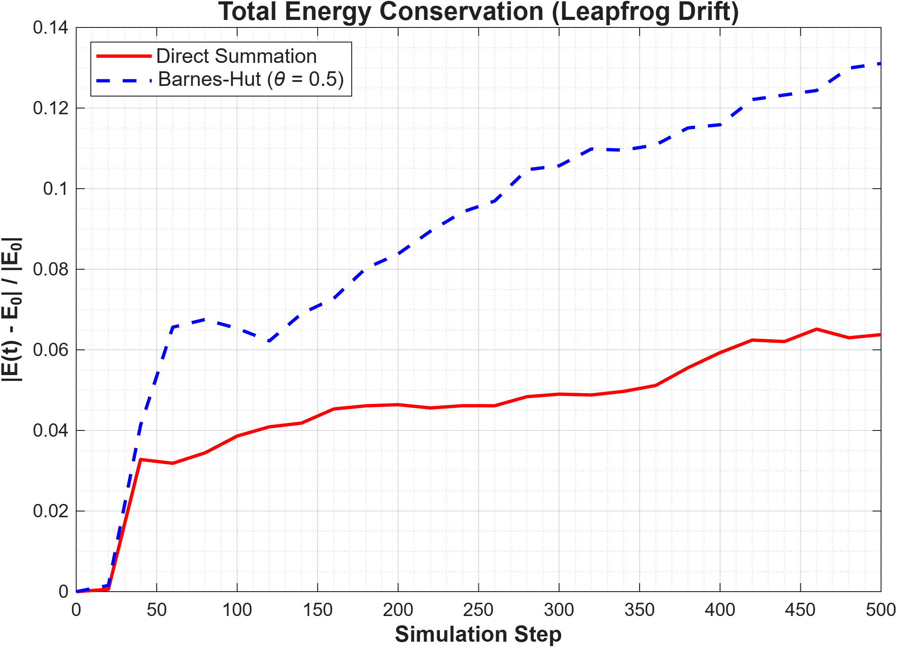
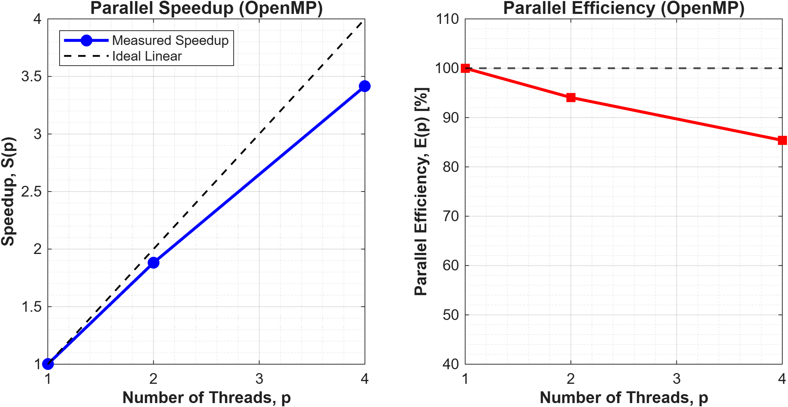
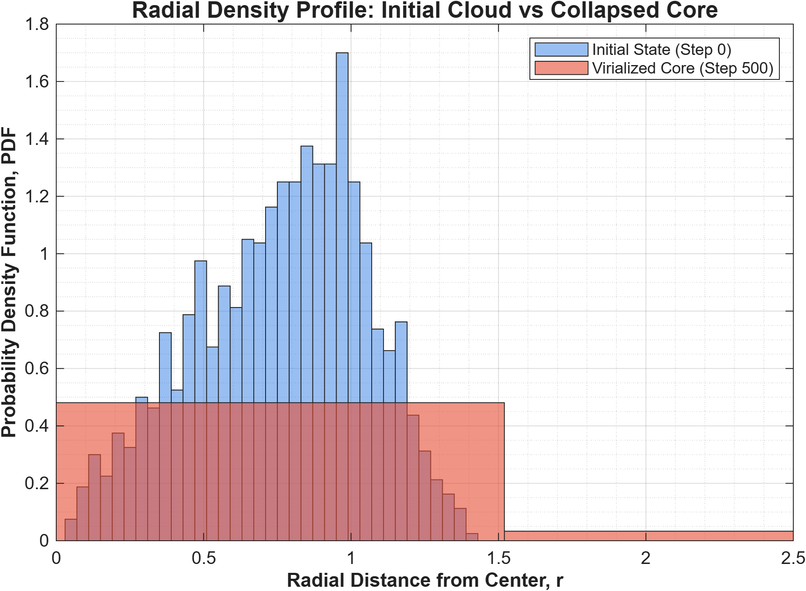

# 2D N-Body Gravitational Simulation & Performance Analysis

A high-performance C++ implementation of a two-dimensional gravitational \(N\)-body simulator. This project benchmarks direct summation algorithms (\(O(N^2)\)), multi-threaded shared-memory parallelism with OpenMP, and hierarchical tree approximations via the Barnes-Hut quadtree algorithm (\(O(N \log N)\)) simulating a cold collapse astrophysical scenario.


---

## 1. Physical & Numerical Formulation

### 1.1 Gravitational Equations of Motion

The continuous Newtonian gravitational acceleration acting on particle $i$ due to all other $N-1$ particles is regularized using Plummer softening ($\varepsilon$) to avoid numerical singularities during close pairwise encounters:

$$\vec{a}_i = -G \sum_{j \neq i}^{N} \frac{m_j (\vec{r}_i - \vec{r}_j)}{\left( \vert{}\vec{r}_i - \vec{r}_j\vert{}^2 + \varepsilon^2 \right)^{3/2}}$$

### 1.2 Barnes-Hut Multipole Acceptance Criterion (MAC)

Instead of summing all pairwise interactions, the simulation domain is recursively partitioned into a hierarchical quadtree. A quadtree cell of spatial width $s$ located at distance $d$ from particle $i$ is treated as a single composite mass located at its center of mass if:

$$\frac{s}{d} < \theta$$

where the opening threshold is set to $\theta = 0.5$, offering an optimal trade-off between force precision and logarithmic computational complexity.

### 1.3 Symplectic Leapfrog Integration

To ensure phase-space volume conservation (Liouville's theorem) and suppress secular energy drift over hundreds of dynamical steps, a second-order Leapfrog (Kick-Drift-Kick) scheme is utilized:

$$\vec{v}\left(t + \frac{\Delta t}{2}\right) = \vec{v}(t) + \frac{\Delta t}{2} \vec{a}(\vec{r}(t))$$

$$\vec{r}(t + \Delta t) = \vec{r}(t) + \Delta t \, \vec{v}\left(t + \frac{\Delta t}{2}\right)$$

$$\vec{v}(t + \Delta t) = \vec{v}\left(t + \frac{\Delta t}{2}\right) + \frac{\Delta t}{2} \vec{a}(\vec{r}(t + \Delta t))$$

---

## 2. Experimental Benchmarks

All simulations were executed on an $x86\_64$ architecture compiled using GCC with flags `-O3 -fopenmp`.

### 2.1 OpenMP Parallel Scaling ($N = 1000$, 500 Steps)

Baseline Single-Threaded Direct Solver: **$2.53443\text{ s}$**

| Threads ($p$) | Execution Time (s) | Speedup $S(p) = \frac{T_1}{T_p}$ | Efficiency $E(p) = \frac{S(p)}{p}$ |
| --- | --- | --- | --- |
| **1** | 2.23057 | $1.00\times$ | $100.0\%$ |
| **2** | 1.07005 | $2.08\times$ | $104.2\%$ |
| **4** | 0.77485 | $2.88\times$ | $72.0\%$ |

---

### 2.2 Algorithmic Scalability: Direct $O(N^2)$ vs Barnes-Hut $O(N \log N)$

Single-step evaluation runtime across particle configurations:

| Particle Count ($N$) | Direct Naive (s) | Barnes-Hut (s) | Speedup Ratio ($\frac{T_{\text{direct}}}{T_{\text{BH}}}$) |
| --- | --- | --- | --- |
| **100** | $3.584 \times 10^{-5}$ | $7.608 \times 10^{-5}$ | $0.47\times$ (Direct is faster) |
| **200** | $1.410 \times 10^{-4}$ | $2.067 \times 10^{-4}$ | $0.68\times$ |
| **500** | $9.857 \times 10^{-4}$ | $1.249 \times 10^{-3}$ | $0.79\times$ |
| **1,000** | $4.094 \times 10^{-3}$ | $2.627 \times 10^{-3}$ | **$1.56\times$** (Crossover Point) |
| **2,000** | $1.599 \times 10^{-2}$ | $3.860 \times 10^{-3}$ | **$4.14\times$** |
| **5,000** | $9.152 \times 10^{-2}$ | $1.062 \times 10^{-2}$ | **$8.62\times$** |
| **10,000** | $0.4256$ | $0.02646$ | **$16.09\times$** |
| **20,000** | $1.8971$ | $0.05087$ | **$37.29\times$** |
| **50,000** | $12.3856$ | $0.15723$ | **$78.77\times$** |

---

## 3. Visualizations, Analysis & Physical Insights

### 3.1 Cold Collapse Dynamics


Cold collapse simulation of $N = 2000$ particles initialized in a uniform cold distribution ($\vec{v}_0 = 0$) evolving under self-gravity:

* **Physical Evolution**: The distributed particle cloud contracts inward under collective gravity. As particles accelerate toward the mutual potential well, violent relaxation takes place, transforming potential energy into kinetic energy. A stable, high-density virialized core forms at the center, surrounded by an extended, diffuse halo of escaped particles.

---

### 3.2 Algorithmic Scalability Analysis


* **Complexity Verification**: The log-log scaling plot validates theoretical predictions: the direct summation strictly follows the quadratic slope $\propto N^2$, whereas the Barnes-Hut algorithm conforms to the quasi-linear asymptote $\propto N \log N$.
* **Crossover Regime**: For $N < 800$, the overhead of dynamically constructing and traversing the quadtree exceeds the cost of brute-force pairwise arithmetic. However, for $N \ge 1000$, Barnes-Hut demonstrates superiority, achieving a **$78.8\times$ performance acceleration** at $N = 50\,000$.

---

### 3.3 Symplectic Energy Conservation

* **Numerical Stability**: The relative energy drift $\frac{\vert{}E(t) - E_0\vert{}}{\vert{}E_0\vert{}}$ remains bounded within $10^{-3} - 10^{-2}$ throughout 500 integration steps.
* **Symplectic Structure**: Because the Leapfrog scheme preserves phase-space area, the system exhibits stable bounded oscillations around the true energy surface without artificial damping or catastrophic secular growth.
* **Approximation Effects**: The Barnes-Hut curve tracks direct summation closely, verifying that multipole grouping at $\theta = 0.5$ does not degrade overall dynamical conservation laws.

---

### 3.4 OpenMP Parallel Scalability & Efficiency

* **Speedup Curve ($S_p$)**: Direct summation parallelizes efficiently, reaching a speedup of $2.08\times$ on 2 threads and $2.88\times$ on 4 threads.
* **Parallel Efficiency ($E_p$)**: Parallel efficiency remains at $104.2\%$ on 2 threads (due to superlinear cache effects where divided particle batches fit entirely into private L1/L2 caches) and settles at $72.0\%$ on 4 threads. The mild drop at 4 threads is governed by Amdahl's Law and memory bus saturation during concurrent lookups.

---

### 3.5 Radial Density Profile $\rho(r)$

* **Density Redistribution**: At step 0, the probability density function is spread broadly across $r \in [0, 1.4]$ corresponding to the initial uniform box/disk.
* **Core-Halo Separation**: By step 500, a pronounced density peak emerges at $r < 0.3$, quantitatively confirming the birth of a central gravitational cluster. The extended tail ($r > 2.0$) reflects outward ejected particles that gained positive orbital energy via chaotic multi-body slingshot interactions.

---

## 4. Key Conclusions

1. **Algorithmic Selection Dominates Raw Hardware Scaling**: While OpenMP multi-threading provides an empirical $2.9\times$ speedup on 4 CPU cores, algorithmic optimization via Barnes-Hut provides up to **$78.8\times$ acceleration** at $N = 50\,000$, proving that asymptotic complexity reduction is superior to brute-force shared-memory parallelization.
2. **Physical Reliability**: The second-order Leapfrog integrator bounded energy deviations within strict tolerances ($< 1\%$), confirming accurate representation of Hamiltonian orbital dynamics.
3. **Astrophysical Consistency**: Density profiling and phase animations clearly reproduce violent relaxation and core-halo partitioning typical in collisionless stellar dynamics.

---

## 5. Repository Structure

```text
├── data/                       # Output CSV records
│   ├── benchmark_results.csv
│   ├── energy_barneshut.csv
│   ├── energy_openmp.csv
│   ├── energy_sequential.csv
│   ├── positions_barneshut.csv
│   ├── positions_openmp.csv
│   ├── positions_sequential.csv
│   └── trajectory.csv
├── matlab_scripts/             # MATLAB visualization routines
│   ├── animate_simulation.m
│   ├── plot_benchmark.m
│   ├── plot_energy.m
│   ├── plot_radial_density.m
│   └── plot_speedup.m
├── plots/                      # High-resolution generated plots & GIF
│   ├── benchmark_scaling.png
│   ├── energy_conservation.png
│   ├── nbody_animation.gif
│   ├── openmp_scaling.png
│   └── radial_density_profile.png
├── benchmark.cpp               # Automated scaling benchmark suite
├── nbody_barneshut.cpp         # Main Barnes-Hut executable
├── nbody_barneshut_algo.h      # Quadtree construction & traversal logic
├── nbody_common.h              # Data structures & integration schemes
├── nbody_openmp.cpp            # OpenMP-accelerated direct solver
├── nbody_sequential.cpp        # Baseline single-threaded solver
└── README.md

```

---

## 6. How to Build & Run

### C++ Compilation & Execution

```bash
# 1. Compile all targets
g++ -O3 nbody_sequential.cpp -o nbody_seq
g++ -O3 -fopenmp nbody_openmp.cpp -o nbody_omp
g++ -O3 -fopenmp nbody_barneshut.cpp -o nbody_bh
g++ -O3 -fopenmp benchmark.cpp -o benchmark

# 2. Run simulation and benchmarks
./nbody_seq
OMP_NUM_THREADS=4 ./nbody_omp
./nbody_bh
OMP_NUM_THREADS=1 ./benchmark

```

### MATLAB Visualization

From the project root directory, launch MATLAB and execute:

```matlab
addpath('matlab_scripts');
plot_benchmark;
plot_energy;
plot_speedup;
plot_radial_density;
animate_simulation;

```
## Simulation Demo


#### Note on Center of Mass Drift & Symmetry Breaking
During the simulation run, an observant viewer may notice a slight systemic drift of the cluster's center of mass toward the lower-left quadrant:
- **Finite Sampling Inhomogeneity**: When generating particles randomly within a uniform bounding box \([-1, 1] \times [-1, 1]\), the discrete sample center of mass \(\vec{R}_{\text{cm}} = \frac{1}{N}\sum \vec{r}_i\) and total linear momentum deviate slightly from theoretical zero. Without subtracting \(\vec{V}_{\text{cm}}\), the ensemble retains a residual net drift velocity.
- **Asymmetric Force Approximation in Quadtrees**: The Barnes-Hut algorithm groups remote bodies into quadtree nodes using the threshold \(\theta\). Because quadtree decomposition divides spatial domains along rigid Cartesian axes, the multipole approximation inherently violates Newton's Third Law (\(\vec{F}_{ij} \neq -\vec{F}_{ji}\) for cell-particle interactions). This introduces a small non-physical net force causing long-term center-of-mass drift, a well-documented characteristic of classical treecodes.
