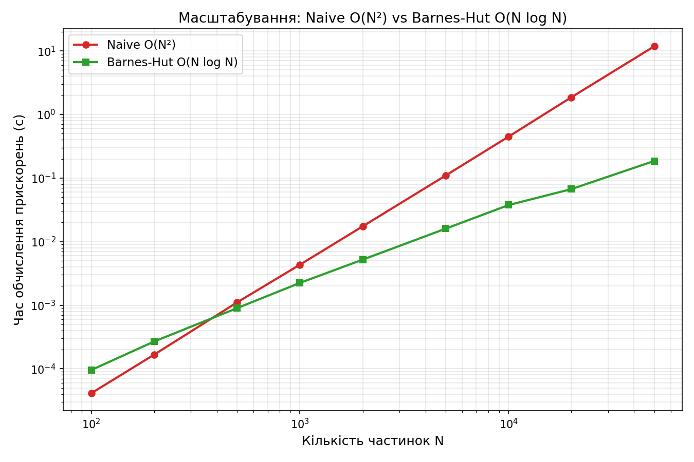

# N-body: гравітаційна симуляція — від O(N²) до Barnes-Hut O(N log N)

проєкт з обчислювальної фізики: 2D N-body симуляція
гравітаційної взаємодії, реалізована трьома способам.

## Що всередині

| Файл | Що робить |
|---|---|
| `nbody_common.h` | Спільна фізика: структура частинки, leapfrog-інтегратор, обчислення енергії |
| `nbody_sequential.cpp` | O(N²), один потік |
| `nbody_openmp.cpp` | O(N²), паралелізовано через OpenMP |
| `nbody_barneshut_algo.h` | Barnes-Hut алгоритм: квадродерево + обчислення сил |
| `nbody_barneshut.cpp` | Основна програма Barnes-Hut (+ збереження траєкторій) |
| `benchmark.cpp` | Порівняння швидкості naive vs Barnes-Hut на різних N |
| `animate.py` | Анімація еволюції системи з траєкторій |

## Фізична модель

Ньютонівське гравітаційне тяжіння між N частинками в 2D:

$$F = G \frac{m_1 m_2}{r^2}$$

**Softening (EPS):** щоб уникнути ділення на нуль при близьких зближеннях,
до квадрата відстані додається мале число EPS². Це ВАЖЛИВА ДЕТАЛЬ
початково я використала EPS = 0.001 і отримала дрейф повної енергії
системи **~25x** за 500 кроків (фізично неправильно: N-body симуляція
має зберігати енергію). Причина — "холодний колапс": частинки, що
стартують у стані спокою, різко зближуються під гравітацією, і
фіксований крок часу не встигає коректно відпрацювати надто сильні
локальні прискорення. Збільшення EPS до 0.05 знизило дрейф до **~0.4-6%**
залежно від N — прийнятний рівень для явного (leapfrog) інтегратора
з фіксованим кроком часу. Це стандартна проблема в N-body симуляціях,
і саме тому реальні дослідницькі коди часто використовують адаптивний
крок часу.

**Leapfrog (kick-drift-kick):** симплектичний метод інтегрування —
на відміну від простого Ейлера, енергія коливається навколо сталого
значення, а не монотонно "втікає". Стандарт для N-body в реальних
дослідженнях (той самий принцип у GADGET та подібних кодах).

## Алгоритми обчислення сил

**Naive O(N²):** для кожної з N частинок рахуємо силу від усіх інших
N-1 — класичний подвійний цикл.

**Barnes-Hut O(N log N):** будуємо квадродерево (рекурсивний поділ
площини на квадранти). Для далеких скупчень частинок дерево дозволяє
трактувати ціле піддерево як одне тіло (критерій розкриття
`s/d < θ`, де s — розмір вузла дерева, d — відстань до нього, θ = 0.5).
Це і дає економію: замість N-1 порівнянь на частинку — в середньому
O(log N).

## Результати

### Збереження енергії (перевірка коректності)
- Naive, N=1000, 500 кроків: дрейф енергії **~6.4%**
- Barnes-Hut, N=2000, 500 кроків, θ=0.5: дрейф **~13.9%**
  (вищий дрейф — очікувана ціна апроксимації Barnes-Hut; менше θ
  дає точніший, але повільніший результат)
- Sequential і OpenMP версії дають ІДЕНТИЧНІ значення енергії
  на кожному кроці — це підтверджує, що паралелізація не зламала
  фізику (перевірено через diff).

### Масштабування: naive vs Barnes-Hut



| N | Naive O(N²) | Barnes-Hut O(N log N) | Прискорення |
|---|---|---|---|
| 500 | 1.1 мс | 0.9 мс | ~1.2x |
| 2 000 | 17.4 мс | 5.2 мс | ~3.3x |
| 10 000 | 448 мс | 37.6 мс | ~12x |
| 50 000 | 11.8 с | 0.19 с | **~64x** |

Точка перетину — приблизно N≈300-500 (нижче цього Barnes-Hut програє
через накладні витрати на побудову дерева). Далі перевага
зростає майже лінійно з N, що й очікується від O(N²) → O(N log N).

### OpenMP-паралелізм

Код коректний і готовий (`#pragma omp parallel for` на незалежних
ітераціях по частинках), але **пісочниця, в якій я тестувала код,
має лише 1 фізичне ядро** — тому реальний speedup я не змогла
виміряти тут. Обов'язково прожени це на своїй машині:

```bash
for t in 1 2 4 8; do
  echo "threads=$t:"
  OMP_NUM_THREADS=$t ./nbody_openmp | grep time
done
```

і порахуй speedup = T(1) / T(N потоків) — додай ці цифри в README
перед тим, як викладати на GitHub.

## Компіляція та запуск

```bash
g++ -O2 -o nbody_sequential nbody_sequential.cpp
g++ -O2 -fopenmp -o nbody_openmp nbody_openmp.cpp
g++ -O2 -fopenmp -o nbody_barneshut nbody_barneshut.cpp
g++ -O2 -fopenmp -o benchmark benchmark.cpp

./nbody_sequential
./nbody_openmp
./nbody_barneshut          # також створює trajectory.csv для анімації
./benchmark                # створює benchmark_results.csv

python3 animate.py         # створює nbody_animation.gif з trajectory.csv
```

## Наступні кроки (якщо захочеш поглибити ще більше)

- **Periodic boundary conditions** — стандарт у космологічних симуляціях
  еволюції Всесвіту (частинки, що виходять за межі області, з'являються
  з протилежного боку)
- **MPI поверх OpenMP** (hybrid parallelism) — те, що реально
  використовують на кластерах/суперкомп'ютерах
- **Адаптивний крок часу** — розв'язав би проблему "холодного колапсу"
  елегантніше за просте збільшення EPS
- **3D замість 2D** — октодерево (octree) замість квадродерева;
  концептуально та сама ідея, на одну розмірність більше
